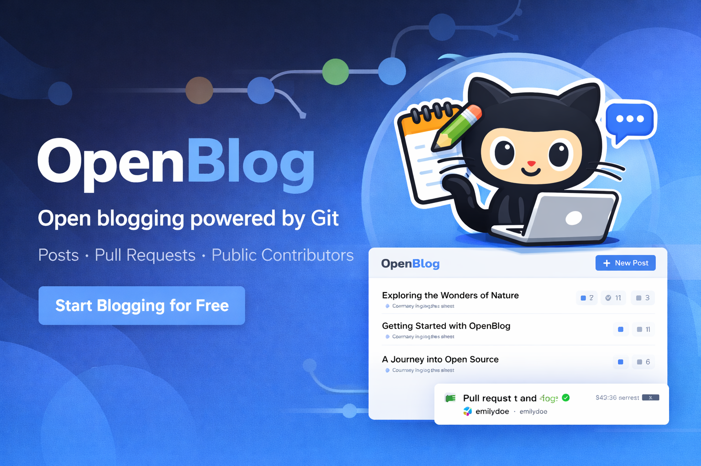

# OpenBlog



[](https://github.com/hajiparvaneh/openblog)
[](https://github.com/hajiparvaneh/openblog/pulls)
[](https://astro.build/)
[](https://nodejs.org/)

Main website: [https://openblog.cc](https://openblog.cc)

OpenBlog is a collaborative technical blog where contributors improve content through pull requests.  
When a PR is merged and labeled, points are added to the public leaderboard.
It is built for developers who want to show teamwork, improve public reputation, and make their GitHub activity more visible for hiring.

## 🎯 Why OpenBlog

- Practice real collaboration in public through focused pull requests
- Build a visible proof-of-work portfolio on GitHub
- Improve technical writing and consistency over time
- Strengthen your profile for job applications and referrals

## 🚀 First Contribution In 5 Steps

1. Fork this repository and clone your fork.
2. Create a branch: `git checkout -b my-post-update`.
3. Add or edit a post in `content/posts/<category>/<post>.md`.
4. Run locally and verify your changes.
5. Open a PR and mention the changed slug (example: `networking/how-dns-works`).

## 🧰 Local Development

### Requirements

- Node.js 18+ (or newer LTS)
- npm

### Run locally

```bash
npm install
npm run dev
```

Open the local URL shown in your terminal.

### Production preview

```bash
npm run build
npm run preview
```

## ✍️ Add A New Blog Post

Create a file at:

`content/posts/<category>/<post>.md`

Important:

- A new folder under `content/posts/` means a new category.
- Be careful when creating categories and reuse existing ones whenever possible.
- Create a new category only when the topic clearly does not fit any current category.

Example:

`content/posts/networking/how-http-works.md`

Use this template:

```md
---
title: How HTTP Works
description: A beginner-friendly explanation of the HTTP request/response model.
date: 2026-03-12
---

Start with a short intro.

## Main section

Add clear examples, references, and practical notes.
```

Content guidelines:

- Keep category and filename lowercase and hyphenated.
- Use clear, consistent category names (for example: `networking`, `security`, `javascript`).
- Prefer clear, factual writing with practical examples.
- Keep PR scope focused on one post/topic where possible.

Detailed post-writing guide (including all metadata fields):

- [POSTS-README.md](POSTS-README.md)

## 🛠️ Improve Existing Posts

Common contribution types:

- Fix typos and wording
- Add trusted sources
- Fact-check outdated statements
- Add examples and clearer explanations
- Add translations

## ✅ PR Checklist

- Changes are in `content/posts/<category>/<post>.md`
- PR description explains what improved and why
- Changed slug(s) are mentioned in the PR
- `openblog/generated/*` is not manually edited

## 🏷️ Scoring Labels

Points are determined by labels in `openblog/enums/scoring-labels.json`:

- `typo`: +5
- `source-added`: +10
- `fix-metadata`: +10
- `fact-check`: +15
- `new-example`: +20
- `translation`: +30
- `new-post`: +50

Each label entry stores:

- `points`: numeric score value
- `icon`: Tabler icon name (for example `file-plus`)
- `color`: display color used in the UI

Rules:

- Only merged PRs are eligible.
- At least one scoring label is required unless the PR adds a new post file.
- New files under `content/posts/<category>/<post>.md` automatically receive `new-post` scoring in automation (even if the label was not applied manually).
- Frontmatter metadata edits (`title`, `description`, `date`, `thumbnail`, `thumbnailAlt`, `tags`, `draft`, `featured`, `lang`, `translateOf`) automatically receive `fix-metadata` scoring (+10) when no `new-post` label applies.
- If multiple scoring labels are applied, points are summed.

Event schema:

- Legacy single-post event: `postSlug`, `labels`, `points`
- Multi-post event (recommended): `contributions` array with `postSlug`, `labels`, and `points`

This allows one merged PR (same `prNumber`) to contribute to multiple posts.

## 📁 Project Structure

- `content/posts/<category>/*.md`: blog content
- `openblog/events/*.json`: immutable merged-PR score events
- `openblog/enums/scoring-labels.json`: score labels metadata (points, icon, color)
- `openblog/generated/users/*.json`: generated user stats
- `openblog/generated/leaderboard.json`: generated leaderboard
- `openblog/generated/categories/*.json`: generated per-category leaderboards
- `scripts/add-event-from-pr.mjs`: create event from merged PR metadata
- `scripts/generate-openblog-state.mjs`: regenerate users, overall leaderboard, and category leaderboards

## 🔧 Maintainer Notes

These commands are primarily for maintainers/automation:

```bash
npm run openblog:add-event
npm run openblog:generate
```

Recommended guardrails:

- Protect `main` branch
- Keep `openblog/generated/*` maintainer/bot-managed
- Enforce scoring-label policy

## 🔐 GitHub OAuth with Cloudflare Worker (Minimal)

This repository now includes a minimal OAuth backend example at:

- `worker/github-oauth-worker.ts`
- Astro demo page at `/github-auth`

### Flow summary

1. Browser requests `GET /login` on the Worker.
2. Worker creates a cryptographically-random `state`, stores it in a short-lived HTTP-only cookie, and redirects to GitHub OAuth authorize page.
3. GitHub redirects to `GET /callback?code=...&state=...`.
4. Worker validates `state` (CSRF protection), exchanges `code` for access token, fetches `GET https://api.github.com/user`, stores token in secure HTTP-only cookie, and returns user JSON.
5. Frontend calls `GET /me`; Worker reads token cookie and returns the authenticated GitHub user.

### Required Worker environment variables

- `GITHUB_CLIENT_ID`
- `GITHUB_CLIENT_SECRET`

### Cloudflare dashboard manual setup

1. Create a GitHub OAuth App:
   - **Homepage URL**: your production site (example: `https://your-domain.com`)
   - **Authorization callback URL**: `https://<your-worker-domain>/callback`
2. In Cloudflare dashboard:
   - Create a Worker (or Pages Function/Worker route) and deploy `worker/github-oauth-worker.ts`.
   - Add Worker **Secrets**:
     - `GITHUB_CLIENT_ID`
     - `GITHUB_CLIENT_SECRET`
   - Add routes so `/login`, `/callback`, `/me`, and optionally `/logout` reach the Worker.
3. Keep the Worker and frontend under the same top-level domain so secure cookies are included automatically.
4. Open `/github-auth` and click **Login with GitHub**.

### Cloudflare Git build settings (for this repo layout)

If you connect this Git repository directly to a Worker build, use these values:

- **Root directory**: `worker`
- **Build command**: `npm run build`
- **Deploy command**: `npm run deploy`
- **Variables and secrets** (required):
  - `GITHUB_CLIENT_ID` (Secret)
  - `GITHUB_CLIENT_SECRET` (Secret)

The `worker/` folder now contains:

- `worker/package.json` (build/deploy scripts + wrangler dependency)
- `worker/wrangler.toml` (`main = "github-oauth-worker.ts"`)

If your Cloudflare project is using repository root (`/`) instead of `worker` as root directory, use:

- **Build command**: `npm run build`
- **Deploy command**: `npm run deploy`

Root-level `deploy` script calls Wrangler with `worker/wrangler.toml`.

### Notes

- This is intentionally minimal: no database, no refresh token, no session store.
- If you rotate GitHub OAuth credentials, update Worker secrets and redeploy.
